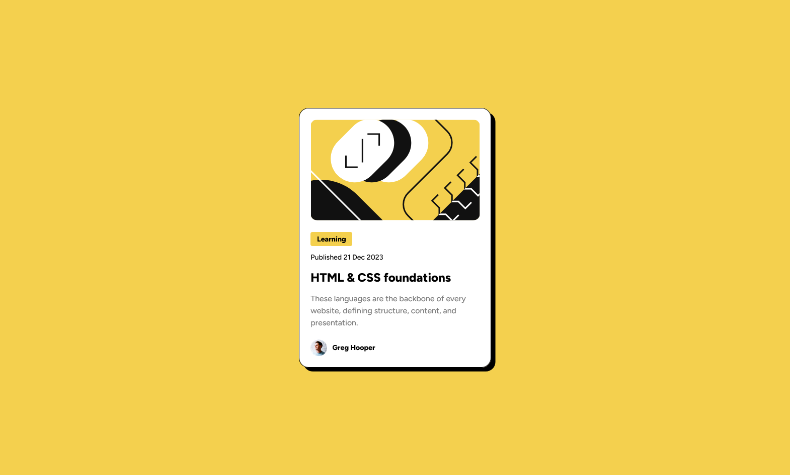

# Frontend Mentor - "Blog Preview Card" solution

This is a solution to the ["Blog Preview Card" challenge on Frontend Mentor](https://www.frontendmentor.io/challenges/blog-preview-card-ckPaj01IcS).

## The challenge

Users should be able to:

-   See hover and focus states for all interactive elements on the page

## Links

-   Solution URL: [https://www.frontendmentor.io/solutions/blog-preview-card-html-scss-7NobMfhz2F](https://www.frontendmentor.io/solutions/blog-preview-card-html-scss-7NobMfhz2F)
-   Live Site URL: [https://redened.github.io/Frontendmentor-Project02/src/](https://redened.github.io/Frontend.Mentor/Solution02/src)

### Screenshot



### What I learned

You can make HTML elements TAB focusable using the "tabindex" attribute.

tabindex="0" will adhere to DOM order of elements when focusing.

tabindex="1", tabindex="2", tabindex="3"... will force the order according to the attribute value. 
(while also forcing the first focus to be the element with value "1", bypassing other elements that could also be focused before it.)

```html
<span tabindex="0">Learning</span>
<h2 tabindex="0">HTML & CSS foundations</h2>
<span tabindex="0">Greg Hooper</span>
```