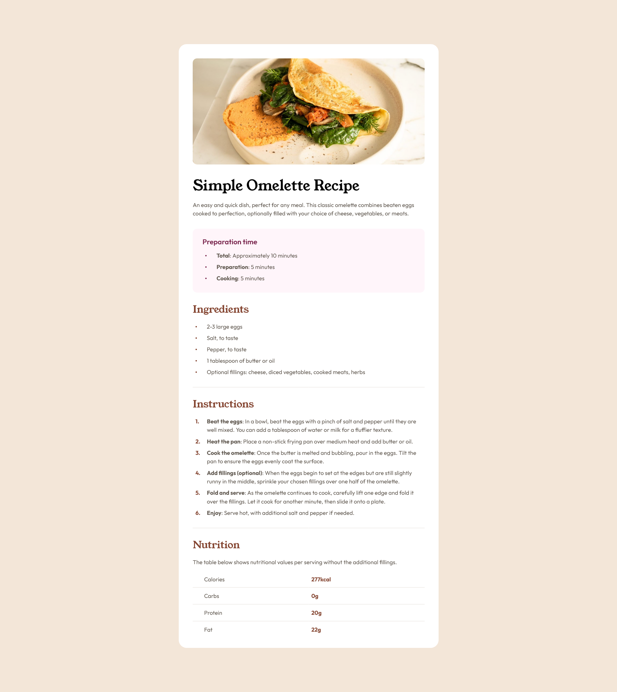

# Frontend Mentor - "Recipe Page" solution

This is a solution to the ["Recipe Page" challenge on Frontend Mentor](https://www.frontendmentor.io/challenges/recipe-page-KiTsR8QQKm). 

## Links

-   Solution URL: [https://www.frontendmentor.io/solutions/recipe-page-html-scss-v5P20SdLiz](https://www.frontendmentor.io/solutions/recipe-page-html-scss-v5P20SdLiz)
-   Live Site URL: [https://redened.github.io/Frontend.Mentor/Solution04/src/](https://redened.github.io/Frontend.Mentor/Solution04/src/)

### Screenshot



### What I learned

Custom Disc or ::marker for Unordered lists using CSS li:before selector.

```css
ul {
    list-style: none;
}

li {
    display: flex;
    align-items: center;
}

li:before {
    content: "•";
    font-size: 15pt;
    margin-right: 2.5rem;
    color: hsl(14, 45%, 36%);
}
```


Custom Number or ::marker for Ordered lists using CSS li:before selector and CSS counter property.

```css
ol {
    list-style: none;
    counter-reset: ordered-list-item;
}

li {
    display: flex;
    align-items: first baseline;
    counter-increment: ordered-list-item;
}

&:before {
    content: counter(ordered-list-item) ".";
    font-weight: 700;
    margin-right: 2rem;
    color: hsl(14, 45%, 36%);
}
```
